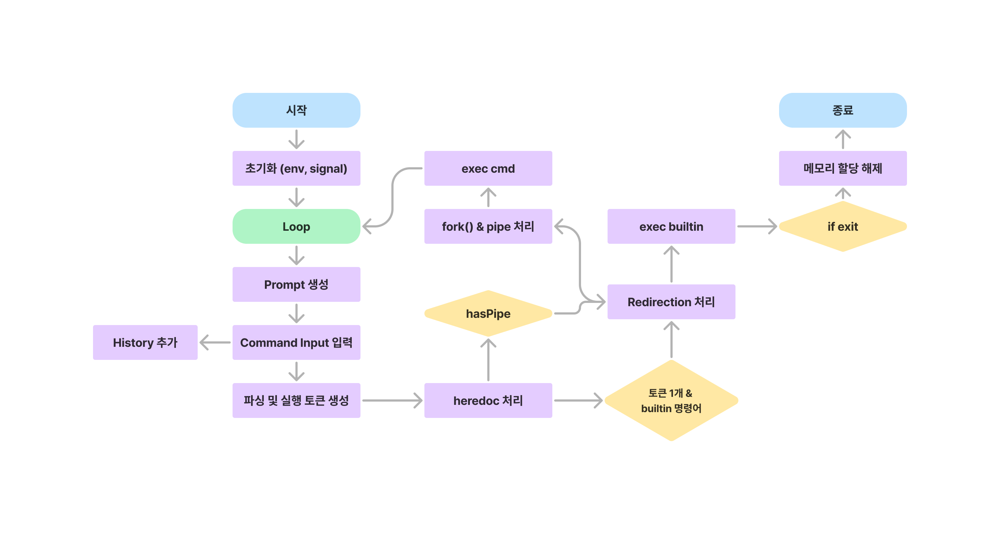

# minishell

## 프로젝트 설명
실제 bash와 같이 동작하는 간단한 쉘을 제작했습니다. 사용자로부터 명령을 받아, 그것을 해석하고 실행합니다. 다음과 같은 기능을 구현했습니다.

<details>
<summary>Details</summary>
<div markdown="1">

- 닫히지 않은 따옴표나 특정되지 않은 특수문자 (\나 ; 등)을 해석하지 않아야 합니다.
- 새로운 명령어를 입력할 수 있는 프롬프트를 제시합니다.
- 작업 히스토리를 갖고 있어야 합니다.
- Builtin function
	- -n 옵션을 사용할 수 있는 `echo`
	- 오직 상대 또는 절대경로만 사용하는 `cd`
	- 옵션이 없는 `pwd`
	- 옵션이 없는 `export`
	- 옵션이 없는 `unset`
	- 옵션이나 인자값이 없는 `env`
	- 옵션이 없는 `exit`
	- 나머지 명령들은 /bin/에 있는 실행파일을 찾아 동작합니다.
- Redirection (<, >, <<, >>)
- Pipe (각 파이프라인마다 명령어의 출력값은 파이프로 연결되어 다음 명령어의 입력값으로 들어가야 합니다.)
- 환경 변수($ 다음에 문자열이 오는 형식)은 그들의 값으로 확장되어야 합니다.
- `$?`는 가장 최근에 실행한 포그라운드 파이프라인의 종료 상태를 확장하여야 합니다.
- ctrl-C, ctrl-D, ctrl-\ 는 bash와 동일하게 동작하여야 합니다.
</div>
</details>

## 흐름도


## 실행 방법
1. readline 라이브러리를 설치한 후 설치 경로를 확인합니다.
```bash
brew install readline
brew info readline
```

2. Makefile에서 해당 부분의 코드를 자신의 설치 경로에 맞게 수정합니다.
```
27 LDFLAGS = -L/goinfre/$(USER)/.brew/opt/readline/lib
28 CPPFLAGS = -I/goinfre/$(USER)/.brew/opt/readline/include
```

3. 빌드를 수행한 후, 생성된 프로그램을 실행합니다.
```
make
./minishell
```
